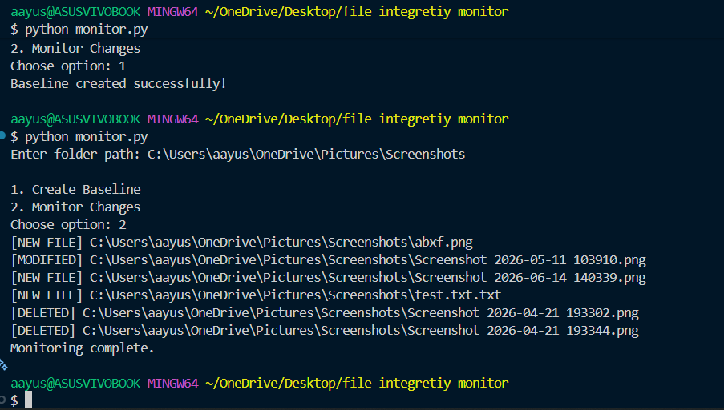

# File Integrity Monitor

A cybersecurity project built using Python that monitors file integrity using SHA-256 hashing.

## Features

- Detects newly added files
- Detects modified files
- Detects deleted files
- Creates a baseline of file hashes
- Uses SHA-256 for integrity verification

## Technologies Used

- Python
- hashlib
- json
- os

## How It Works

1. Create a baseline of all files in a folder.
2. Store SHA-256 hashes in a JSON file.
3. Compare future scans against the baseline.
4. Report any changes detected.

## Example Output

[NEW FILE] test.txt

[MODIFIED] image.png

[DELETED] oldfile.png

## Future Improvements

- Multithreading
- GUI Dashboard
- Real-time Monitoring
- Email Alerts
## Demo

Example output of the File Integrity Monitor:

